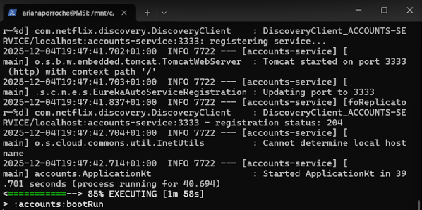
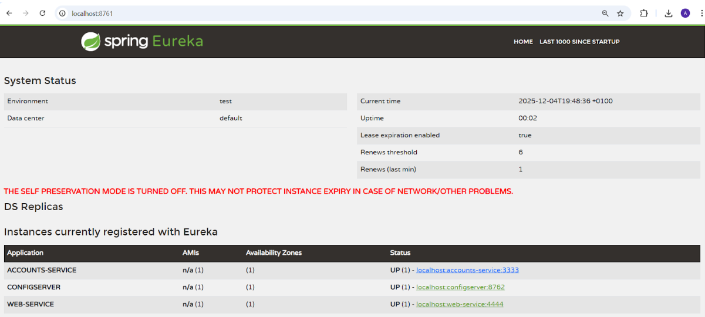
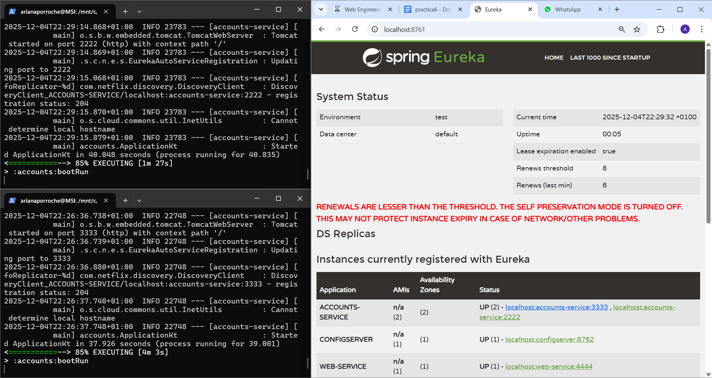
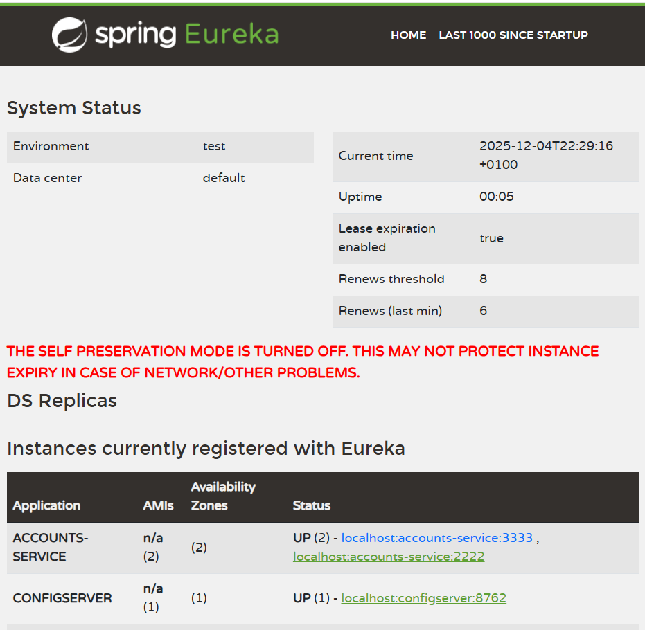
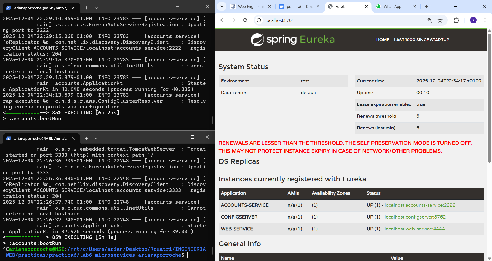

# Lab 6 Microservices - Project Report

**Author:** Ariana Porroche Llorén (874055)

**Date:** 04th December 2025

**Course:** Web Engineering


## 1. Configuration Setup

- Modifications in `accounts-service.yml`
```
# HTTP Server
server:
  port: 2222
```
- Why is externalized configuration useful in microservices?

---

## 2. Service Registration (Task 1)

### Accounts Service Registration



Explain what happens during service registration.
```
2025-12-04T19:47:41.837+01:00  INFO 7722 --- [accounts-service] [foReplicator-%d] com.netflix.discovery.DiscoveryClient    : DiscoveryClient_ACCOUNTS-SERVICE/localhost:accounts-service:3333 - registration status: 204
```

### Web Service Registration


Explain how the web service discovers the accounts service.
```
2025-12-04T19:48:13.766+01:00  INFO 8203 --- [web-service] [foReplicator-%d] com.netflix.discovery.DiscoveryClient    : DiscoveryClient_WEB-SERVICE/localhost:web-service:4444 - registration status: 204
```

---

## 3. Eureka Dashboard (Task 2)



Describe what the Eureka dashboard shows:

- Which services are registered?
- What information does Eureka track for each instance?

---

## 4. Multiple Instances (Task 4)



Answer the following questions:

- What happens when you start a second instance of the accounts service?
- How does Eureka handle multiple instances?
- How does client-side load balancing work with multiple instances?

---

## 5. Service Failure Analysis (Task 5)

### Initial Failure



Describe what happens immediately after stopping the accounts service on port 3333.

### Eureka Instance Removal



Explain how Eureka detects and removes the failed instance:

- How long did it take for Eureka to remove the dead instance?
- What mechanism does Eureka use to detect failures?

---

## 6. Service Recovery Analysis (Task 6)


Answer the following questions:

- Why does the web service eventually recover?
- How long did recovery take?
- What role does client-side caching play in the recovery process?

---

## 7. Conclusions

Summarize what you learned about:

- Microservices architecture
- Service discovery with Eureka
- System resilience and self-healing
- Challenges you encountered and how you solved them

---

## 8. AI Disclosure

**Did you use AI tools?** (ChatGPT, Copilot, Claude, etc.)

- If YES: Which tools? What did they help with? What did you do yourself?
- If NO: Write "No AI tools were used."

**Important**: Explain your own understanding of microservices patterns and Eureka behavior, even if AI helped you write parts of this report.

---

## Additional Notes

Any other observations or comments about the assignment.

